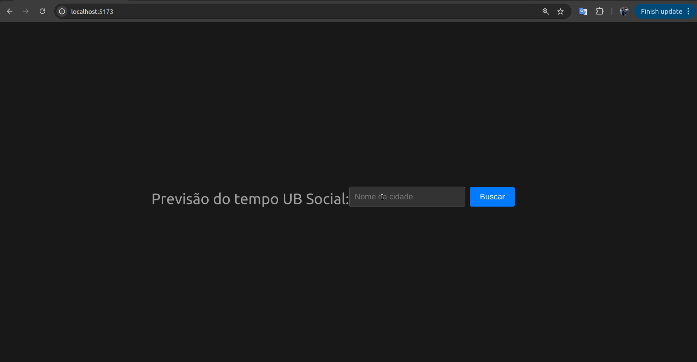

# Weather Forecast App

A simple weather forecast application built with Vue.js.

## ✨ Features

- Search for weather forecasts by city name.
- Display detailed city data (population, coordinates, etc.).
- Weather forecast for the next few days, in 3-hour intervals.
- Error handling for cities not found or connection issues.

## 🚀 How to Run

1. Clone the repository:
   ```bash
   git clone https://github.com/laisrod/OpenWeather.git
   ```
2. Install the dependencies:
   ```bash
   npm install
   ```
3. Run the development server:
   ```bash
   npm run dev
   ```

## 🎬 Demo



## 🛠️ Technologies Used

- [Vue.js](https://vuejs.org/)
- [Vite](https://vitejs.dev/)
- [Axios](https://axios-http.com/)
- [OpenWeatherMap API](https://openweathermap.org/api)
